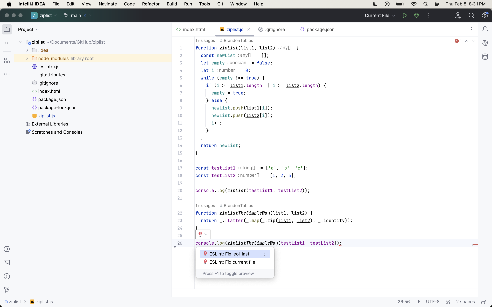
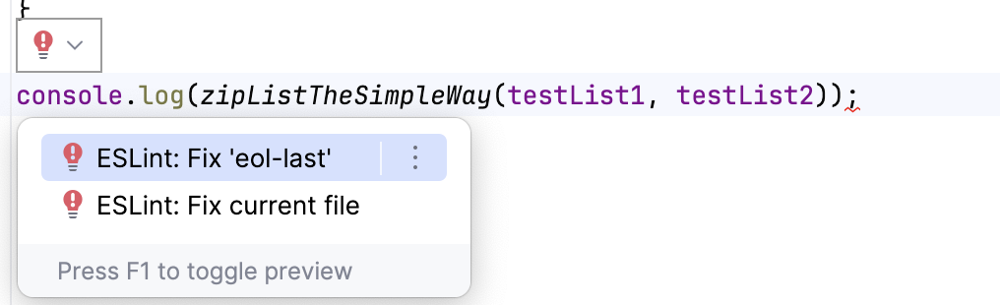
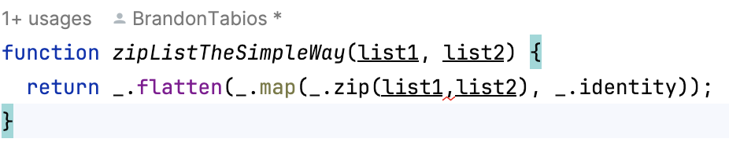

## Codestyles are important

From all of my experience with coding, I am certain that codestyles are important. Codestyles allow for a much simpler way of showcasing your code. It is similar to speaking formally when needed to, in the sense that it accomplishes a goal based on the situation. Some of the advantages to codestyles are allowing a simple way of displaying your code to others. By defining a codestyle, it somewhat forces people to code in similar ways. This is because codestyles enforce a specific style that everyone needs to follow. Having code be defined in a codestyle also helps the professors or higher ups understand the code much easier. In a way its a win-win for everyone. So what could be the issue?

## It feels like such a hassle

The only real problem with enforcing coding styles is the human factor of not wanting to do more work for a purpose that does not benefit you. I personally do not find it that troublesome to deal with, however there are certainly times that I don't want to deal with it. I find it a hassle when coding styles require specific changes that feel very unneccessary. For example in the functions we needed to define for ICS314 homework. The coding style required all strings to be written with single quotes('') all files ending in a newline character, and needing specific spacing for parameters and so forth. Again I did not feel like this was impossible to deal with, but it certainly added more time then needed.

## All in all

I titled this essay necessary evil because I do agree that coding styles are a necessity for students and people coding together, however I don't think that makes it fun unfortunately. Some ways to work around the hasle could be to create functions that change code to fit code styles automatically. This is nearly already in IntelliJ, with most errors being able to fix them with given suggestions. The problem is that it is difficult for programs to be able to completely understand what the expectations should be so it is difficult to be done automatically. 
