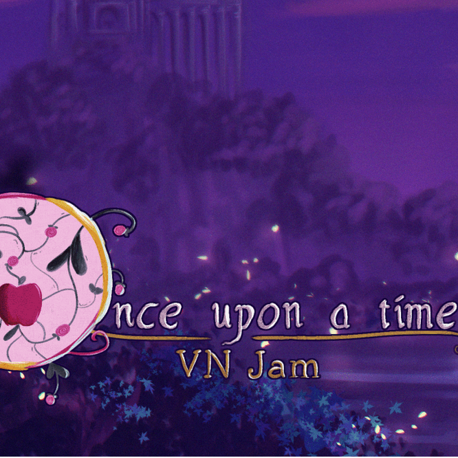

## Working on a game jam

A game jam for those unaware is a competition set where people can work to create a game together. Usually these competitions have a set theme and people work together to create something. Although there is a theme, game jams are often times broad enough where games are vastly different. This is great and what makes game jams fun is the amount of creativity that goes around, but that also leads to conflicts as well. As there are many ideas thrown around, it is difficult to choose just one, and it is very difficult to not over complicate things. Game jams are an excellent example of teamwork as there are multiple teams. A game usually has departments in game design, artwork, and sound design, but even then it goes even deeper. Game design has both the planning and creation of the game, and art can be different in game art and character design. Sound design is diverse as some people want to work on sound effects while others choose to work on music like me.

The game jam I worked on was actually run by our Game Dev Club at ACManoa. The game jam in question was the Once Upon a VN Jam (https://itch.io/jam/once-upon-a-time-vn-jam). This game jam was designed in order to make a virtual novel of a fairy tale story. I chose to work on music as this game jam was specifically tailored more towards artistic value, and not much input I could add with code.

## Writing a song tailored for a game

Without getting too indetail of the story written, a lot of the story was written around horror themes. The creation of the story was written by the students and was built together off forming ideas with one another. So to write a song based around horror themes, it was obvious to me to make it very sinister and sad. I will admit that writing a song for a game, when the game is not completely done is quite difficult, as the game has a strong connection with the song in choice. I had to communicate well with the team in charge of writing the story in order for me to succeed well.

## How I wrote the song

The song written was created in an application titled "Musescore". I was already familiar with writing music, as it was a hobby and activity that I spent my own time learning. Creating the song took me a couple of days as I struggled to figure out how to write in a style that was appropriate for the game in mind. In doing so I learned about musical techniques and ideas such as writing sinister songs with a sharp baseline for a more dramatic effect. In the end of creation I felt pretty proud and wanted to continue more projects as so.

For those interested I made a video of the song here: https://www.youtube.com/watch?v=mryucf1tZ90 
