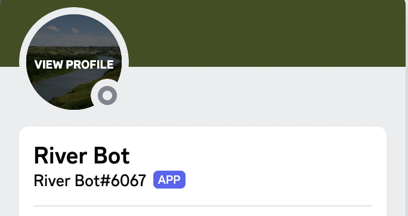
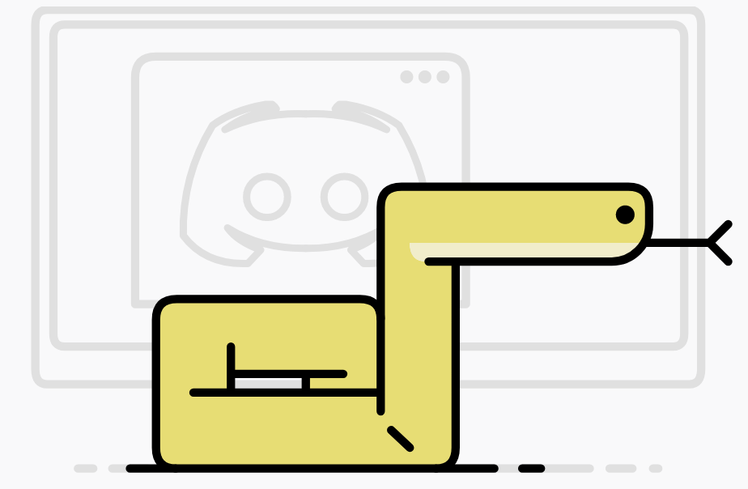

## My Big Problem

I always struggle with making deadlines, and staying in track of thinngs. Often times I have technology right next to me and I still am able to ignore it. For those who are unaware of what Discord is. It is an online platform which is made to keep online communities together. This is commonly used between gaming communities, but is also used for students. As someone who plays quite a bit of video games, I always have Discord open. I believed I could use Discord in order to stay on time of things. I use both a Windows machine and an Apple phone so there isn't a simple situation to get notifications for messages, alarms, and calls from both. However Discord is able to send me notifications to my laptop, tablet, phone, and computer all at once, so I knew Discord was the right application to create this for. Secondly I knew if I created a bot to keep track of my schedule, I could have full control on what it displays, how it notifies me, how I schedule it etc. By creating a Discord Bot I now had a tool I could use whenever I wanted.

## How it was Created

The Discord Bot is written in Python. I originally created it using a tutorial I found online, but I needed to learn how to implement things my self. I used the Discord Python Documentation, and learned how to create things that way. Creating a Discord Bot using Python was good for being able to use await and async syntax, allowing me to create functions that relied on things happening at a set time. This was very important for a scheduling bot. 

## Current State

The Dicord Bot currently is not in a complete state. However, I was able to understand how to make Discord alert me and send me a specified message given a specified time. I know how to do it but I am still pondering on how I want it to be displayed, or how to make it more effective. Like all my other projects, I have no clear goal of what something needs before I deem it is done. I titled my Discord Bot River-Bot as River is an important name to my family.

The repository for my bot is shown here: https://github.com/BrandonTabios/River-Bot
