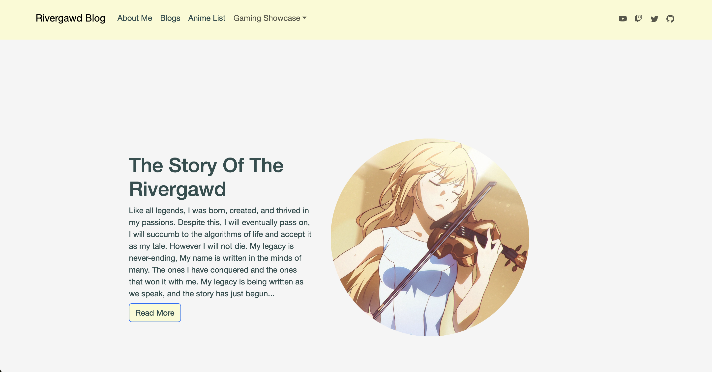

## The Story of the Rivergawd

I learned how to create a website through my ICS314 course. I later saw an opportunity for a job that needed web design and created a website as proof of knowledge that I could make one. Despite the fact that I learned how to do things in class, making my own projects without any guideline proved to be quite difficult. Everything that is implemented on the site is created by me. Without a template or guidelines I could follow I often times felt lost. However I eventually got my site up and running and can proudly present it today.

The title of the site is "The Legend of the Rivergawd" because my online persona when I make videos is named "Rivergawd". Part of the reason this site exists is for me to try and grow myself as a content creator. I want to start posting youtube videos and stream content. I believe making a site that was easily accessible from potential viewers would be exciting. The site now contains links to all my socials for viewers to see as well as displays things such as blogs I write or things I would like to show off. 

## Never Ending Loop

As I discussed before some of the issues I experienced was do to not have anyone to rely on when making it. One of the challenges I experienced was understanding how to run a website through github pages. As well as understanding why it would sometimes break. One of the ways I fixed my site was using HashRouting instead of BrowserRouting as sometimes pages would random not connect properly. Other things I noticed when working on the site was that I often felt like I was challenged artistically more than logically. I wanted my website to seem really exciting to use, but I had no training in creating art, or the layout that my site would need. I often looked at websites that I found to be unique and tried to mimic it as part of my site. 

I believe this project is never ending because nothing ever claims it as done. I still work on this project from time to time because nothing really gets finished, and I realized that I want to keep adding mroe and more. I am proud of what I created, and what to show it off.

## The Legend has just Begun

This project is something that I keep adding to as I learn more and more into software engineering. I put the skills I learned from React.js and implemented them but there is still much more I could add. I want to embed new videos or live streams so that any viewer would instantly be aware of new videos being released. I want to be able to read APIs and display them for things in specific online competitive games. I am glad I was able to showcase what I learned from a class and what to keep doing more. 

Link to the GitHub Repository here: https://github.com/BrandonTabios/BrandonTabios.github.io
Link to the Website: https://rivergawdv1.github.io/rivergawd-blog/

