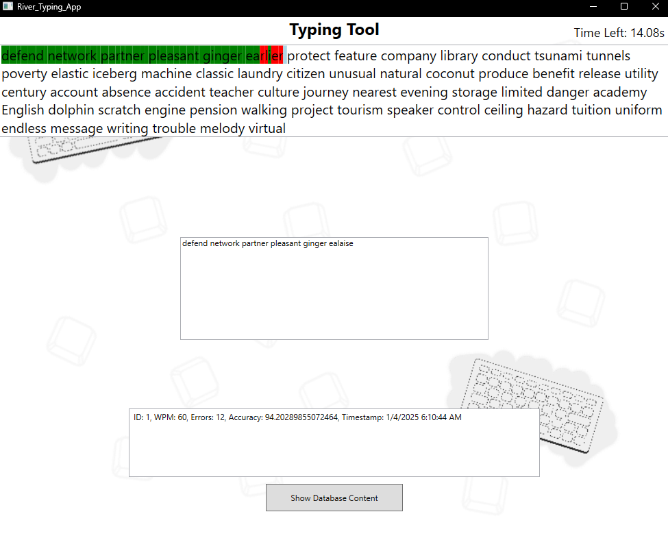
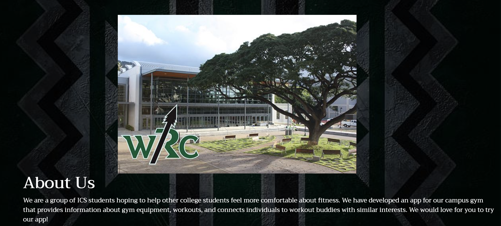
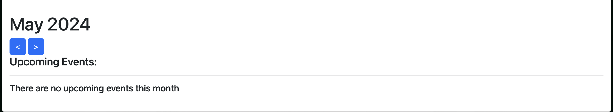

## Scratching your own Itch

When I first went to University one of the first things I noticed in comparison to high school was that it felt a lot more isolated. In schools we have groups and the students around you are usually around your age. You often work together with similar people and it feels easy to connect with others. University is different. People are adults and have busy lives they attend to. It doesn't feel easy to speak with someone that you never have interacted with. A big part of Manoa Fit Connect is helping students come together.

The purpose for the application of Manoa Fit Connect is to help people in the community of Manoa to connect together at the gym. We planned multiple ways to do this. Such as having a friends page to connect with others, or joining upcoming events together. 

## My Work

For my side of the project I was in charge of two of the main pages the About Page, and the Events Page. The About Page is much more simple in comparison, as the page only talks about our vision and each of us as members. The Events Page was where I put the majority of my effort. The Events Page held an event list and allowed any user to be able to post their event for others to see. It also acted similarly to a calendar where the events were sorted by month viewed. The top menu of the site also has a bell that states about upcoming events happenign soon.

Besides these two pages I worked on smaller tasks like the landing page for users not logged in, and making the website look cleaner.

## Important Takeaways

One of the big things that I learned from this is not to be the guy that people can't rely upon. It is really easy for solo projects to be forgotten, but you cannot do that for a team project. People rely on you to create what you make and you have that same expectation for others. Secondly it is important to communicate well with your team on what is happening. If people are expecting something from you, either you need to get it done, or explain any of the blockers preventing it from getting done. However, when everyone puts in the work, it is great to look back on an amazing thing that people together can create.

Read more about our project here: https://manoa-fit-connect.github.io/

See the website in full action here: https://manoafitconnect.com

